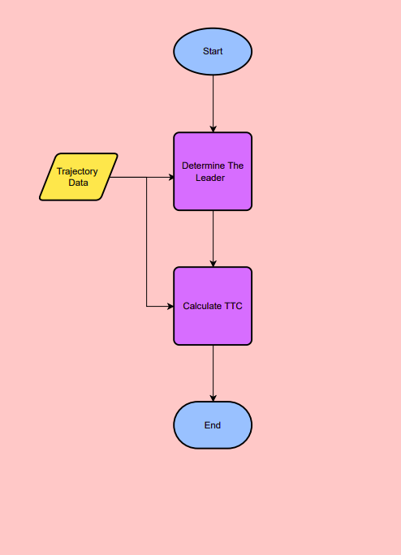

## AMAG Technical Exersise

This repository contains my solution to AMAG Technical Exercise.\
The problem is to findout the leader and follwer and minimum TTC (time to collision)


### Exicuting Program


to get the leader in each timestamp and also the minimum TTC run this on the terminal
```bash
   python trajectory_processor.py path_to/trajectory1.csv path_to/trajectory2.csv
```


here csv file needs to be in this format:

<!-- Tables -->
| Time (s)     | Latitude          | Longitude|
| -------- | -------------- |  -------------- |
| 2 | -27.93454934 |  0 |153.3911746 |
| 3 | -27.93454934 |  0 |153.3911746 |
 


 Here is the flow diagram of the logic of the program

